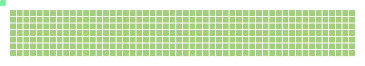

# Hi there, I'm Mark! 👋

Welcome to my GitHub profile! I'm a passionate developer who loves creating innovative projects and exploring new technologies.

## 🏍️ Watch AI Light Cycles Race Through My Contribution Data

<picture>
  <source media="(prefers-color-scheme: dark)" srcset="output/tron-dark.svg" />
  <source media="(prefers-color-scheme: light)" srcset="output/tron-light.svg" />
  
</picture>

*🎮 This shows 4 AI-powered light cycles racing through my actual GitHub contribution patterns! The animation updates daily with fresh data.*

## 🚀 About Me

- 🔭 I'm currently working on innovative GitHub visualizations and gaming projects
- 🌱 I'm always learning new technologies and exploring creative coding solutions
- 🎮 I love combining data visualization with interactive gaming experiences
- 💫 Fun fact: I created the Tron Light Cycles animation you see above!

## 🛠️ Technologies & Tools

## 📊 GitHub Stats

## 🎨 Featured Projects

### 🏍️ [Tron Light Cycles for GitHub](https://github.com/markpython86/tron-github)
Transform any GitHub contribution grid into an animated Tron Light Cycles arena! Like the popular snk project, but with AI-powered light cycles racing through your coding activity.

### 🎮 [My Personal Tron Game](https://markpython86.github.io/markpython86-tron-github/)
An interactive version of the Tron game using my own contribution data. Watch 4 AI cycles compete in real-time!

## 📫 How to Reach Me

- 💼 LinkedIn: [Connect with me](https://linkedin.com/in/markpython86)
- 🐦 Twitter: [@markpython86](https://twitter.com/markpython86)
- 📧 Email: mark@example.com
- 🌐 Website: [markpython86.dev](https://markpython86.dev)

## 🎯 Fun Facts

- 🏍️ The Tron animation above is generated using a sophisticated AI system with 8+ decision factors
- 🎨 I'm passionate about combining data visualization with gaming aesthetics
- 🚀 I love creating tools that make GitHub profiles more engaging and interactive
- 🎮 The light cycles in my animation use neural network-inspired pathfinding algorithms

---

⭐ **Like what you see?** Consider starring my repositories and following for more innovative projects!

 